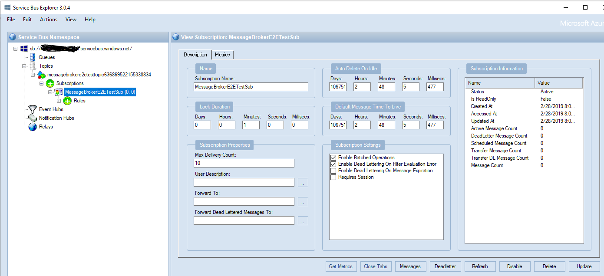

# Azure Service Bus Facade

This is a facade / wrapper around Azure Service Bus *MOM. 

*a Messaging Oriented Middleware (MOM)

- Some of the features:
-- connection builder 
-- easy to use connection pool
-- reuse of connections (desirable)
-- SQL filters for subscriptions
-- stats

- How to run the tests:

The project can be easily tested by running the end to end (E2E) tests. Just add you Azure Service Bus connections string.

    string _connectionString = "Add your azure service bus connection string here";

Further info about Azure service bus can be found here:
https://docs.microsoft.com/en-us/azure/service-bus-messaging/service-bus-messaging-overview
